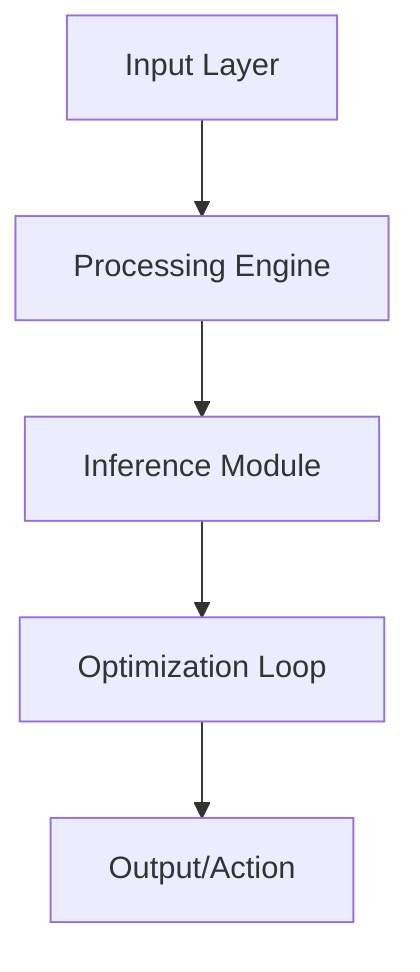

# 🤖 Neural Data Migration

[](LICENSE)
[](https://www.python.org/)
[](#)

High-performance ETL pipeline for high-dimensional neural network datasets.

## 🏗️ Architecture



## 🌟 Key Features
- **Zero-copy Data Transfer**
- **Neural Tensor Versioning**
- **Schema Evolution Support**

## 🛠️ Technology Stack
- `Apache Arrow`
- `Parquet`
- `DVC`
- `Pandas`

## 🚀 Installation

```bash
git clone https://github.com/YannLeCun25/neural-data-migration.git
cd neural-data-migration
pip install -r requirements.txt
```

## 📂 Project Structure
```
├── src/            # Modular source code
├── tests/          # Unit & integration tests
├── docs/           # Technical documentation
├── requirements.txt # Dependency list
└── setup.py        # Package installation
```

Developed by **Yann LeCun** (Elite AI Engineer).
